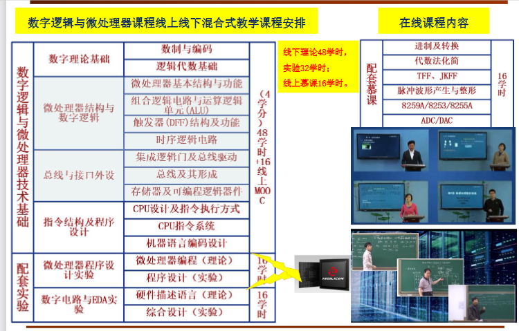

# 第一章：数制与编码

## 后续课程关联

后续课程：EDA（FPGA设计）、单片机、计算机组成原理、集成电路设计、高速数字设计……

## 相关技术行业

- **数字集成电路**：数字集成电路设计、测试、验证和制造，如：音视频解码器、AI控制器
- **嵌入式系统**：各种小型电子控制系统设计，如：扫地机器人、无人机、平衡车
- **数字电路系统**：各种电子系统内部电路设计，如：通信基站电路、手机内部电路
- **近年热门技术**：人工智能芯片设计（2016年创立的深鉴科技于2018年被Xilinx收购，据称达3亿美元）

## 1.1 数制

| 进制 | 基数 | 数字符号 | 后缀/前缀 |
|------|------|----------|-----------|
| 二进制 | 2 | 0, 1 | B 或 0b |
| 八进制 | 8 | 0~7 | O |
| 十进制 | 10 | 0~9 | D（默认）|
| 十六进制 | 16 | 0~9, A~F | H 或 0x |

### 进制转换

**十进制 → 二进制**：除2取余法（整数部分），乘2取整法（小数部分）

**二进制 → 十六进制**：每4位二进制对应1位十六进制

例：`1101 1010B = DAH`

## 1.2 编码

### BCD 码（8421码）

用4位二进制表示1位十进制数（0~9）。

| 十进制 | BCD码 |
|--------|-------|
| 0 | 0000 |
| 5 | 0101 |
| 9 | 1001 |

### 格雷码（Gray Code）

相邻两个数之间只有1位不同，常用于减少转换误差。

### ASCII 码

用7位二进制编码表示128个字符（字母、数字、特殊符号等）。
